# vIDE - vibecoding IDE

An agentic IDE — an Electron desktop app built around terminal AI
coding agents, with a full editor, git tooling, and a mobile companion
display. It currently ships with support for Claude Code and local
models, with more agents planned.


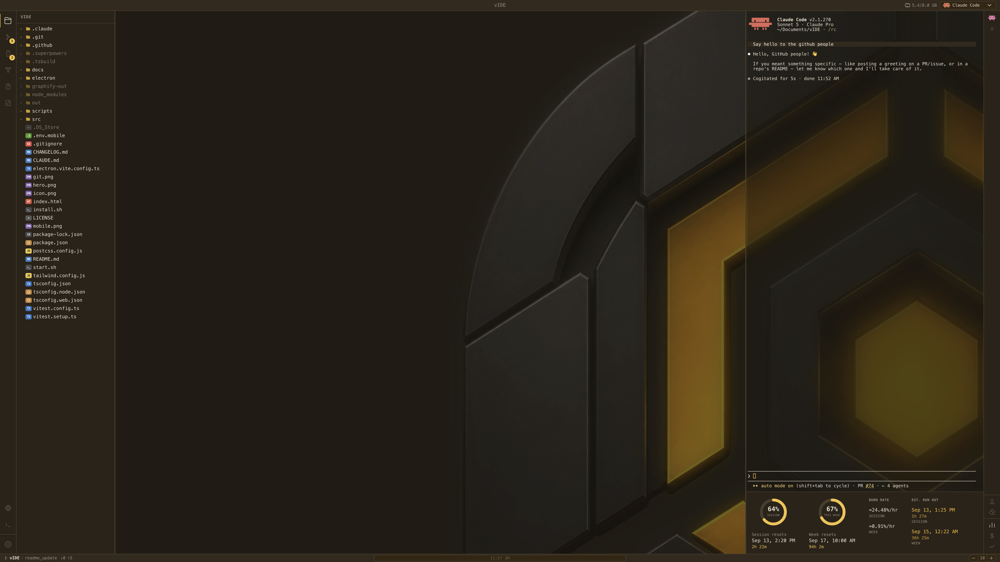

> **Not affiliated with Anthropic.** vIDE integrates the Claude Code CLI as
> a terminal agent, and includes a Llama panel for running local models via
> llama.cpp and a Bridge panel for any OpenAI-compatible endpoint. It is an
> independent, unofficial project — "Claude" is a trademark of its respective
> owner.

## What it is

vIDE wraps a Monaco-based code editor, a real terminal, and git tooling
around one or more AI coding agents running side-by-side, so you can drive
an agent and review/edit its changes in the same window instead of
switching between a browser, a terminal, and an editor.

Keeping vIDE's own memory footprint low is a deliberate, ongoing focus —
Bridge exists so a local LLM can run on the same machine, and every
megabyte vIDE uses itself is a megabyte not available to that model. The
memory indicator built into the status bar is there to keep that honest.

## Features

- **Editor** — Monaco-based code editing with syntax highlighting, custom
  themes, and a Markdown editor/preview split view
- **Go to definition** — Cmd+click jumps to a symbol's definition, backed by
  real language servers for TypeScript/JavaScript, Python, Go, and Rust
- **Inline AI edit** — Cmd+K edits code in place from a prompt, no need to
  round-trip through the chat panel
- **Find in files** — project-wide search (Cmd+Shift+F)
- **Claude panel** — run Claude Code as a first-class terminal agent, with
  support for multiple concurrent sessions
- **Llama panel** — manage and chat with local LLMs via
  [llama.cpp](https://github.com/ggml-org/llama.cpp): configure models, launch
  `llama-server` without leaving the app, and select any running model from the
  same dropdown as Claude and Bridge. Auto-launches the server on first message
  if it isn't already running. Per-model agent-mode-on-launch setting.
- **Bridge panel** — connect to any OpenAI-compatible local LLM endpoint
  (Ollama, LM Studio, …) with agent mode, tool-call limits, and per-session
  history
- **Git** — multi-repo panel, log/graph view, branch diff view, stage &
  commit, push/pull, all without leaving the app
- **Integrated terminal** — a real shell (via `node-pty`) alongside the
  agent panels
- **To Do board** — a Kanban-style board with its own MCP server, so agents
  can create and update tickets directly
- **Notes** — a built-in notes app, also exposed to agents via its own MCP
  server
- **Browser panel** — a full in-app browser tab, with an MCP toolset so
  agents can navigate, click, and read pages directly
- **Docker panel** — manage containers and see memory/resource usage
  without leaving the app
- **Jira** — point it at your team's Jira instance and it opens as an
  in-app browser tab
- **Mobile Display** — pair a phone over your local network (QR code + PIN)
  to either view usage stats on a second screen, or load the real vIDE
  editor/terminal/agent panels as a fully interactive second client of the
  same backend
- **Graphify** — build and browse a knowledge graph of the open codebase,
  right inside the app
- **Usage tracking** — Claude usage/burn-rate monitoring built into the
  status bar; the RAM hover shows system, vIDE, Docker, and Llama memory
  at a glance
- **Command palette & shortcuts overlay** — keyboard-first navigation

| Git tooling | To Do board | Mobile Display |
|---|---|---|
| 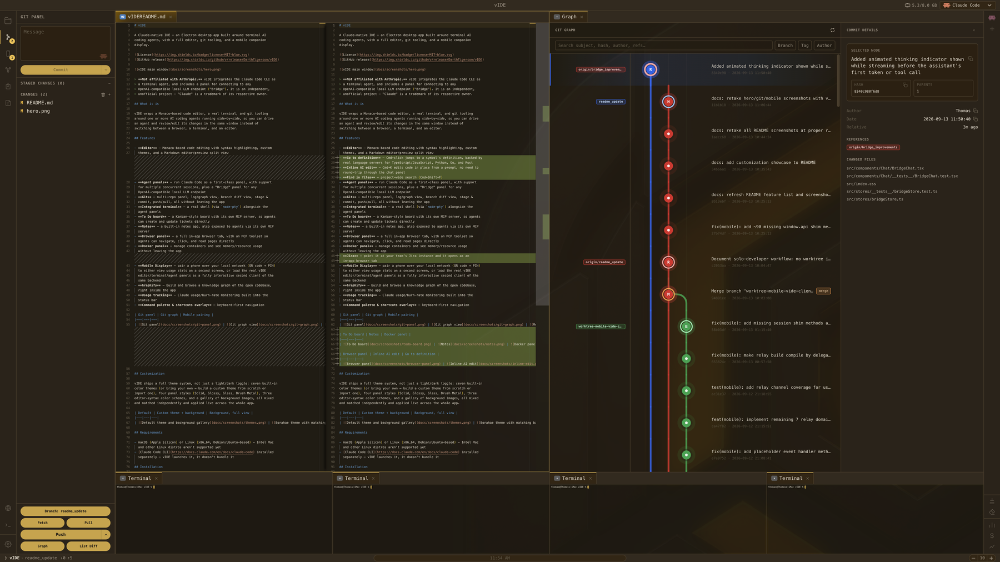 | 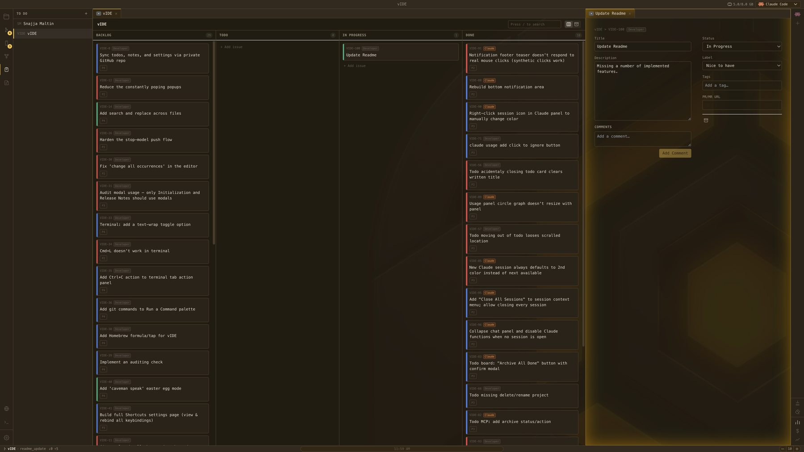 | 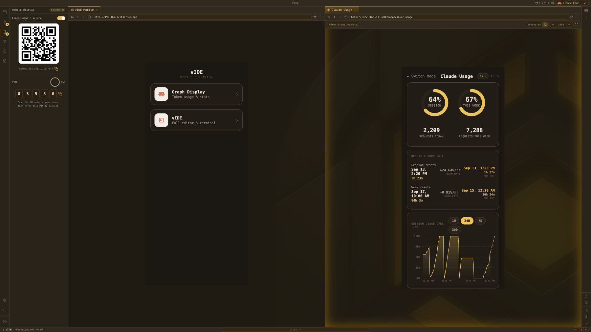 |

| Inline AI edit | Browser panel |
|---|---|
| 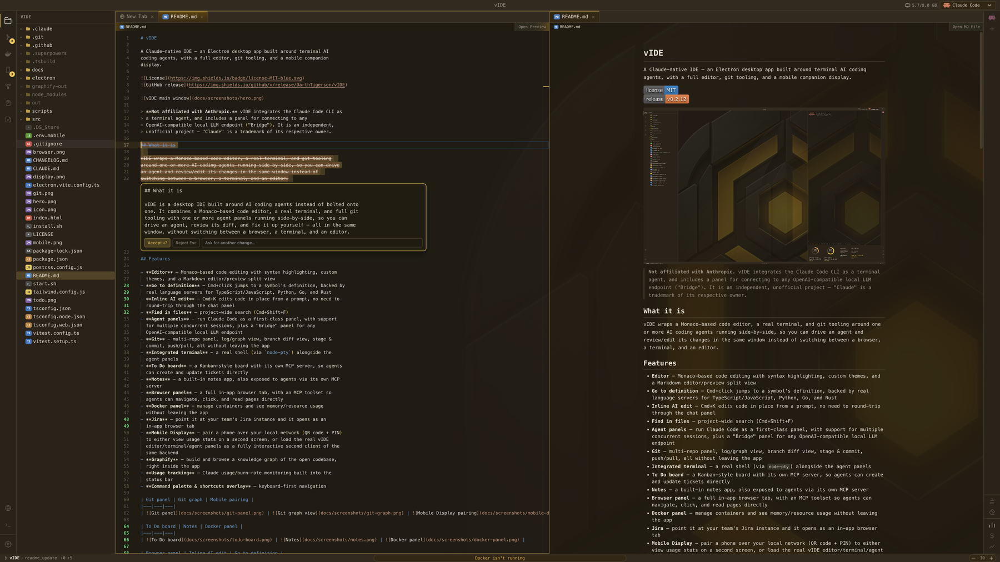 | 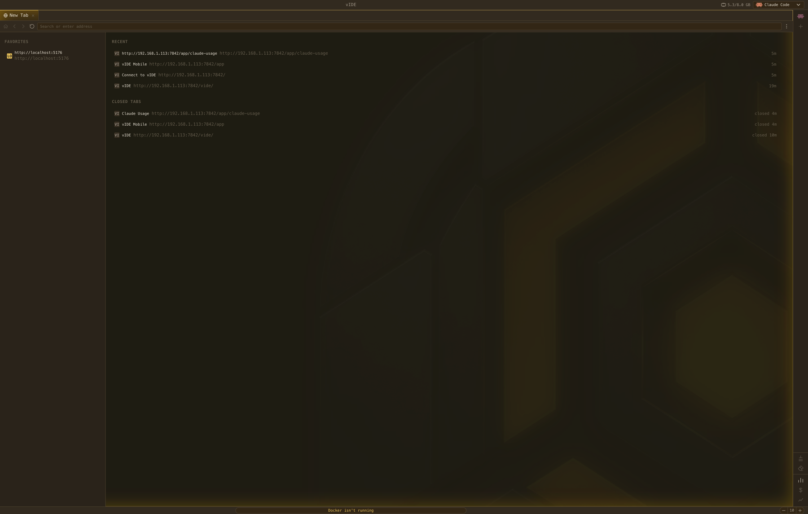 |

## MCP servers

Three of vIDE's own panels are exposed as MCP servers, so a connected agent
can drive them directly instead of needing separate tool wiring:

- **To Do board** — create, update, comment on, and archive tickets
- **Notes** — read and write notes
- **Browser** — navigate, click, and read pages

## Customization

vIDE's interface can be tailored without tying visual choices together.
Themes, panel materials, editor syntax colors, fonts, and backgrounds are
each configured independently, applied live across the whole app — from a
minimal setup to a fully personalized workspace.

### Built-in themes

<table>
<tr>
<td width="50%" align="center">
<strong>Claude</strong><br><br>
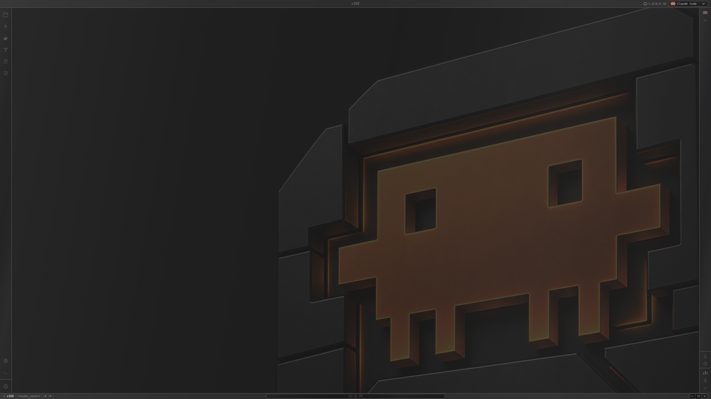
</td>
<td width="50%" align="center">
<strong>vIDE</strong><br><br>
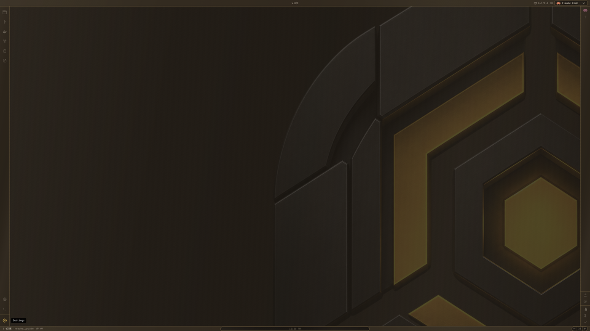
</td>
</tr>
<tr>
<td width="50%" align="center">
<strong>Link</strong><br><br>
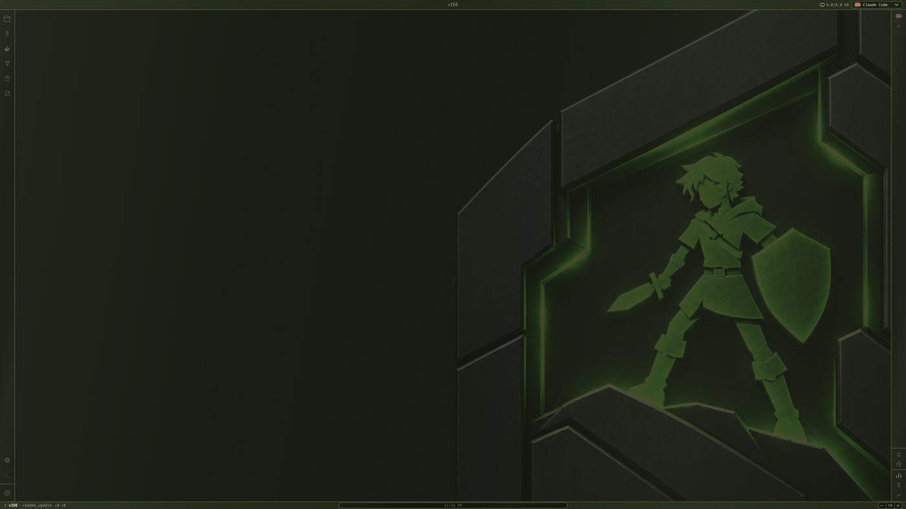
</td>
<td width="50%" align="center">
<strong>Atreus</strong><br><br>
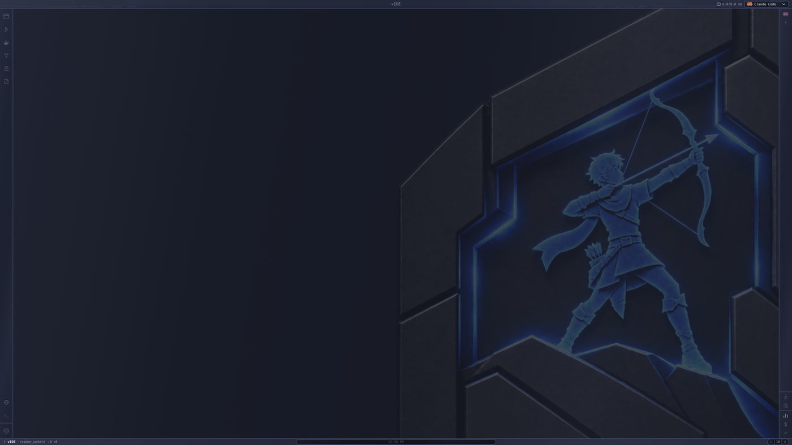
</td>
</tr>
<tr>
<td width="50%" align="center">
<strong>Borahae</strong><br><br>
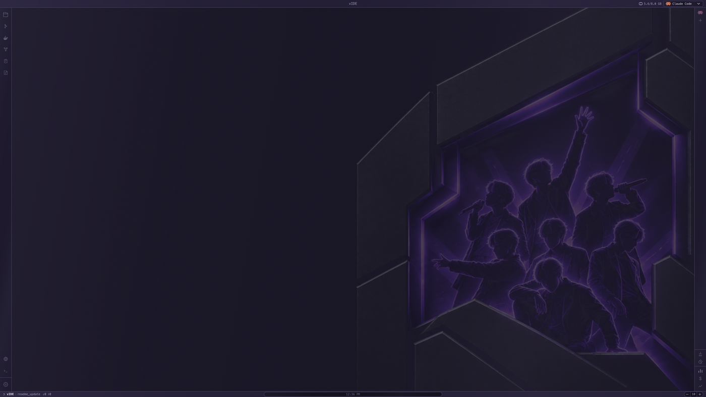
</td>
<td width="50%" align="center">
<strong>Gabriele</strong><br><br>
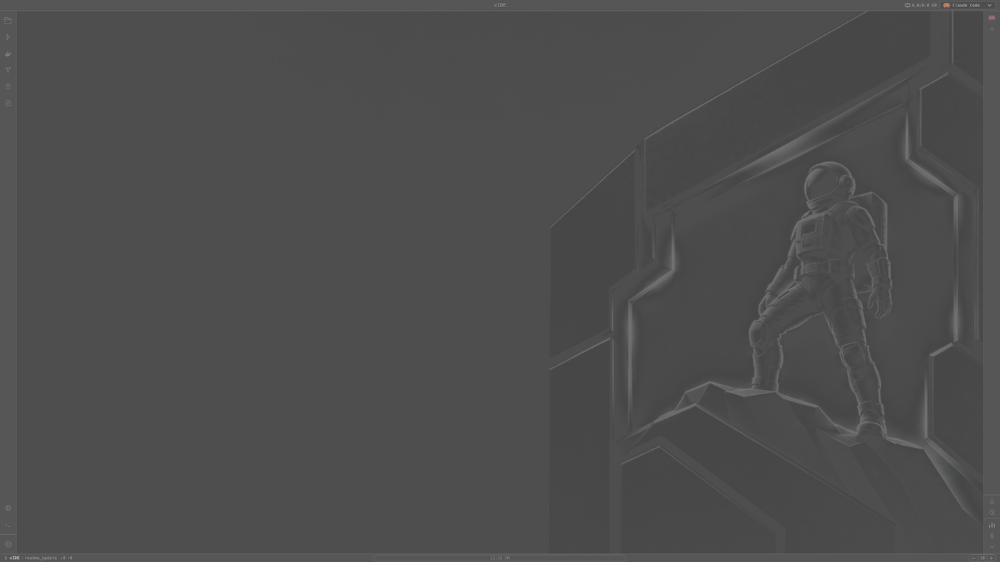
</td>
</tr>
<tr>
<td width="50%" align="center">
<strong>Luuk</strong><br><br>
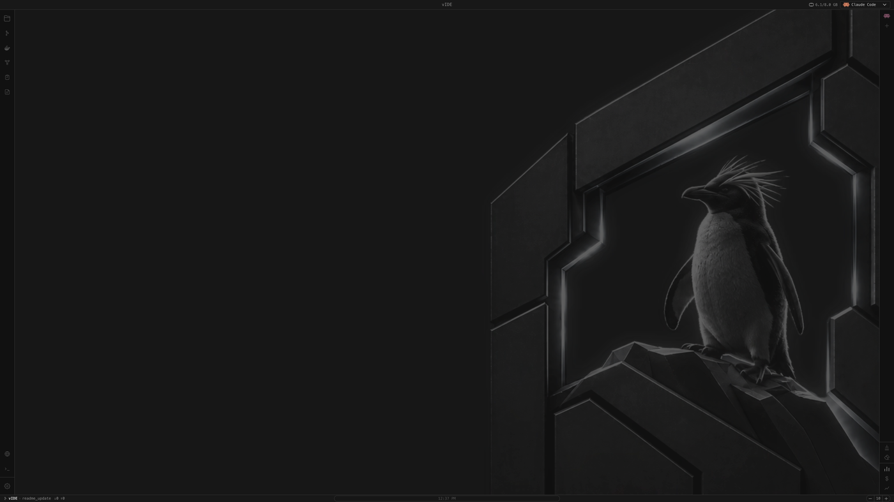
</td>
<td width="50%" valign="middle">

**Or build your own**

Create a theme from scratch, or import one, with its own color swatches.

Combine any theme independently with:

- Four panel materials — Solid, Glossy, Glass, Brush Metal
- Three editor-syntax color schemes
- A choice of fonts
- A gallery of background images

</td>
</tr>
</table>

### Mix and match

The theme you pick doesn't dictate the rest of the interface — panel
material, editor syntax scheme, font, and background all mix independently,
so the same base theme can produce very different-looking workspaces.

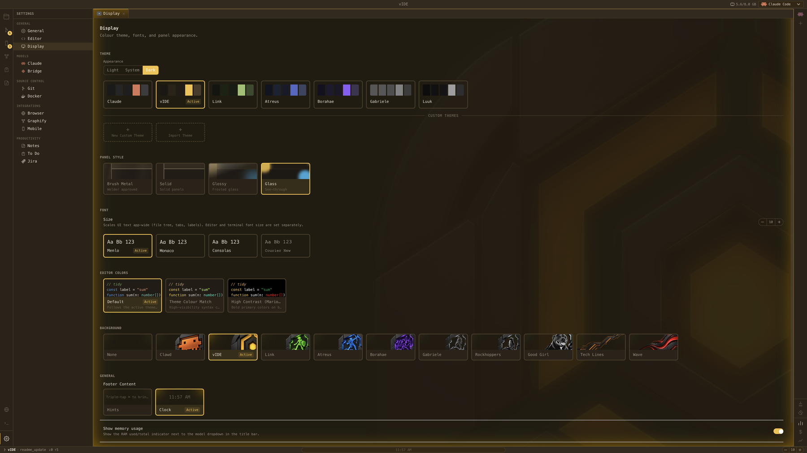

## Requirements

- macOS (Apple Silicon) or Linux (x86_64, Debian/Ubuntu-based) — Intel Mac
  and other Linux distros aren't supported yet
- [Claude Code CLI](https://docs.claude.com/en/docs/claude-code) installed
  separately — vIDE launches it, it doesn't bundle it
- **For the Llama panel** (optional): [llama.cpp](https://github.com/ggml-org/llama.cpp)
  (`brew install llama.cpp` on macOS) and at least one `.gguf` model file

## Installation

```bash
curl -fsSL https://raw.githubusercontent.com/DarthTigerson/vIDE/main/install.sh | bash
```

This downloads the latest release and installs it — to `/Applications` on
macOS, or `~/.local/share/vide` (with a `vide` command symlinked into
`~/.local/bin`) on Linux.

### Manual installation

Download the latest archive for your platform from the
[Releases page](https://github.com/DarthTigerson/vIDE/releases):

- **macOS**: download `vIDE-arm64.zip`, unzip it, and drag `vIDE.app` to
  Applications. If macOS reports the app as "damaged" (a Gatekeeper quirk
  for unsigned, browser-downloaded apps — the app isn't actually damaged),
  run:
  ```bash
  xattr -cr /Applications/vIDE.app
  ```
- **Linux**: download `vIDE-x64.tar.gz` and extract it wherever you like:
  ```bash
  mkdir -p ~/.local/share/vide
  tar -xzf vIDE-x64.tar.gz -C ~/.local/share/vide
  ~/.local/share/vide/vide
  ```

### Build from source

```bash
git clone https://github.com/DarthTigerson/vIDE.git
cd vIDE
```

- **macOS**: run `./start.sh` — it installs dependencies, rebuilds native
  modules, and downloads the Electron binary if `npm install`'s scripts got
  blocked, before launching the dev build.
- **Linux**:
  ```bash
  npm install
  npm run dev
  ```

To build your own archive:

```bash
npm run dist:mac    # produces vIDE-arm64.zip under release/
npm run dist:linux  # produces vIDE-x64.tar.gz under release/
```

## Contributing

Issues and pull requests are welcome. This is an early-stage project, so
expect some rough edges.

### Contributors

- [](https://github.com/DarthTigerson) **Thomas Bonnici** — [@DarthTigerson](https://github.com/DarthTigerson)
- [](https://github.com/GGre4) **Gabriele Grech** — [@GGre4](https://github.com/GGre4)
- [](https://github.com/taspanja) **Keith Fenech** — [@taspanja](https://github.com/taspanja)

## License

[MIT](LICENSE)
